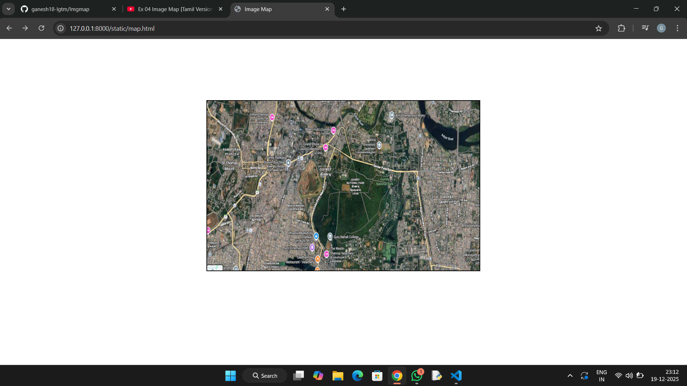
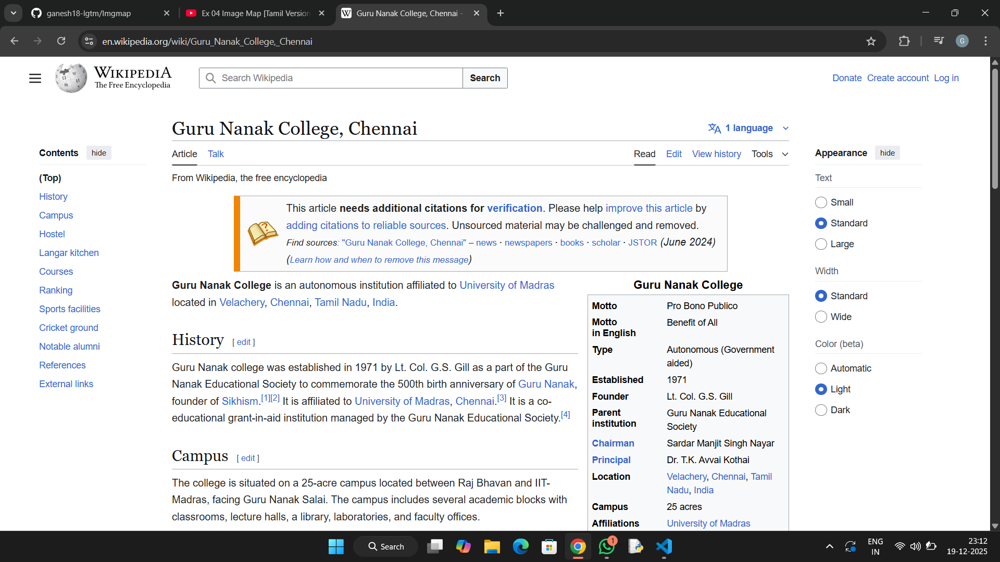
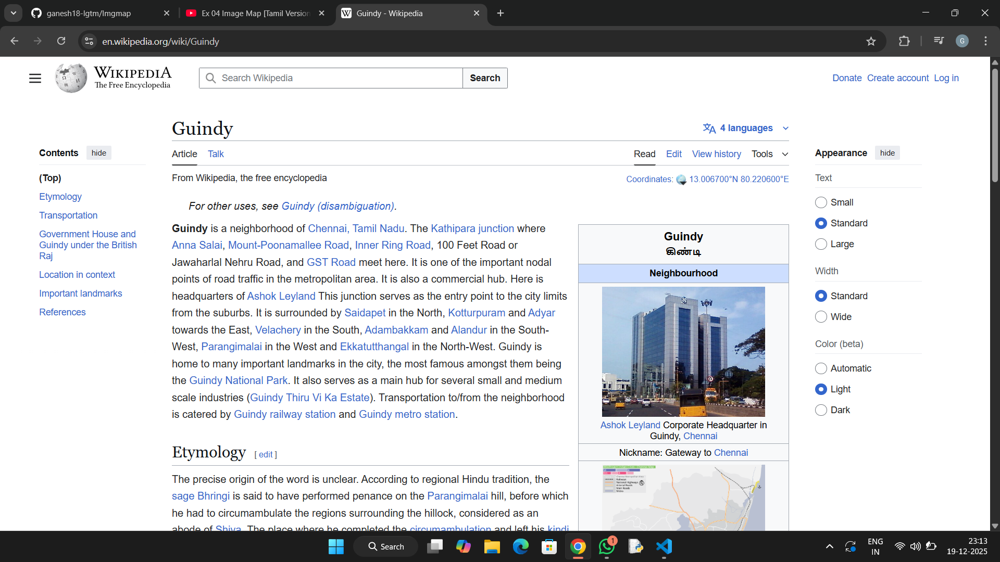
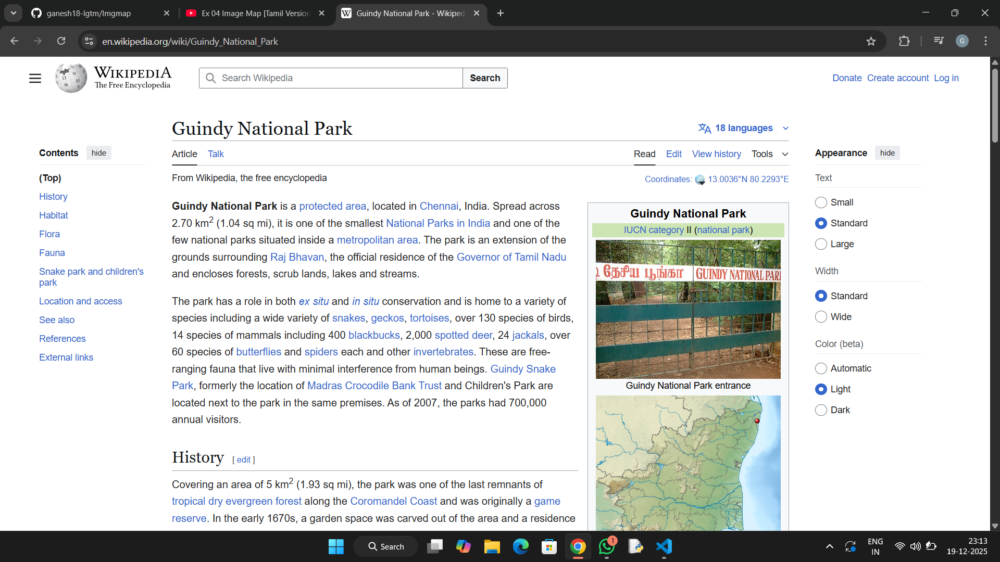

# Ex04 Places Around Me
## Date: 03/12/2025
## REF NO: 25013050

## AIM
To develop a website to display details about the places around my house.

## DESIGN STEPS

### STEP 1
Create a Django admin interface.

### STEP 2
Download your city map from Google.

### STEP 3
Using ```<map>``` tag name the map.

### STEP 4
Create clickable regions in the image using ```<area>``` tag.

### STEP 5
Write HTML programs for all the regions identified.

### STEP 6
Execute the programs and publish them.

## CODE
```
map.html

<!DOCTYPE html>
<html lang="en">
<head>
    <meta charset="UTF-8">
    <meta name="viewport" content="width=device-width, initial-scale=1.0">
    <title>Image Map</title>
    <style>
        img{
            display: block;
            margin: auto;
            margin-top: 9%;
            border: 2px solid black;
        }
    </style>
</head>
<body>
    

    <map name="workmap">
    <area shape="rect" coords="290,172,333,250" alt="Guindy_National_Park" href="https://en.wikipedia.org/wiki/Guindy_National_Park">
    <area shape="rect" coords="336,112,879,280" alt="Guindy" href="https://en.wikipedia.org/wiki/Guindy">
    <area shape="circle" coords="337,300,44" alt="Guru_Nanak_College" href="https://en.wikipedia.org/wiki/Guru_Nanak_College,_Chennai">
    </map>
</body>
</html>


```

## OUTPUT






## RESULT
The program for implementing image maps using HTML is executed successfully.
